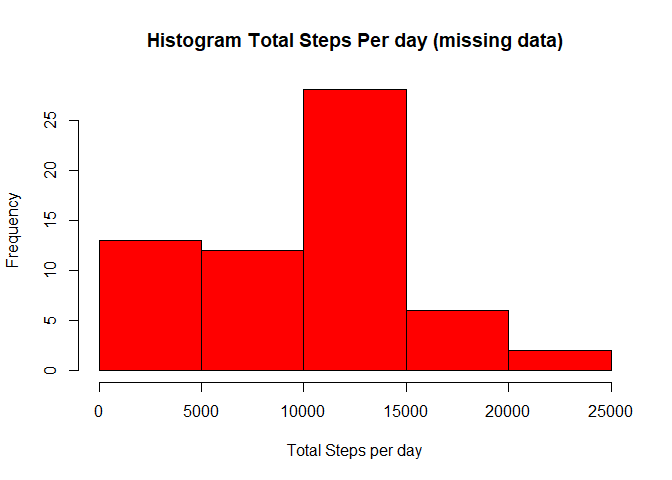
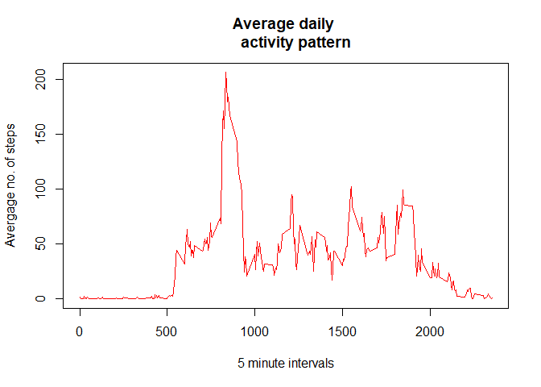
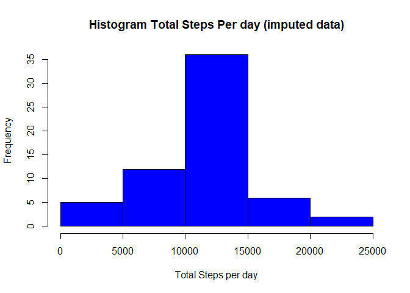
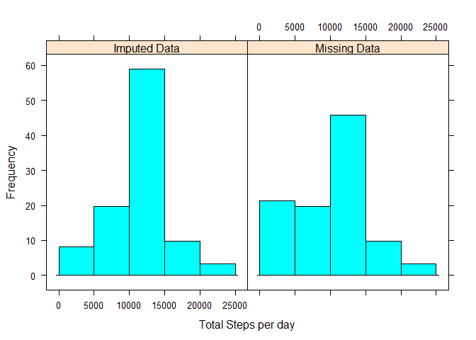

# Reproducible Research: Peer Assessment 1


## Loading and preprocessing the data

Reading the file in and converting the Date column into date format. 
Also adding Day names column and a Day type column. A sample of the processed data is shown below.


```r
actdata<-read.csv("activity.csv")
actdata$date<-as.Date(actdata$date , format="%Y-%m-%d")
actdata$day = strftime(actdata$date,'%A')
weekdayslist <- c('Monday', 'Tuesday', 'Wednesday', 'Thursday', 'Friday')
actdata$DayType <- factor((weekdays(actdata$date) %in% weekdayslist), 
                   levels=c(FALSE, TRUE), labels=c('weekend', 'weekday')) 
print(head(actdata))
```

```
##   steps       date interval    day DayType
## 1    NA 2012-10-01        0 Monday weekday
## 2    NA 2012-10-01        5 Monday weekday
## 3    NA 2012-10-01       10 Monday weekday
## 4    NA 2012-10-01       15 Monday weekday
## 5    NA 2012-10-01       20 Monday weekday
## 6    NA 2012-10-01       25 Monday weekday
```

## What is mean total number of steps taken per day?
1. Caluclating the total number of steps per day. A sample of the data is shown below.


```r
datatotalstepsperday<-aggregate(actdata$steps,by=list(actdata$date),FUN=sum,na.rm = TRUE)
names(datatotalstepsperday)<-c("date","Total_Steps_Day")
print(head(datatotalstepsperday))
```

```
##         date Total_Steps_Day
## 1 2012-10-01               0
## 2 2012-10-02             126
## 3 2012-10-03           11352
## 4 2012-10-04           12116
## 5 2012-10-05           13294
## 6 2012-10-06           15420
```
2. Histogram of the total number of steps taken each day


```r
histdata=hist(datatotalstepsperday$Total_Steps_Day,xlab = "Total Steps per day",main = "Histogram Total Steps Per day (missing data)", col="red")
```

<!-- -->

3.1 The mean total number of steps each day


```r
dataavgstepsperday<-aggregate(actdata$steps,by=list(actdata$date),FUN=mean,na.rm = TRUE)
names(dataavgstepsperday)<-c("date","Avg_Steps_Day")
meantotstepsperday<-as.integer(mean(datatotalstepsperday$Total_Steps_Day,na.rm = TRUE))
print(dataavgstepsperday)
```

```
##          date Avg_Steps_Day
## 1  2012-10-01           NaN
## 2  2012-10-02     0.4375000
## 3  2012-10-03    39.4166667
## 4  2012-10-04    42.0694444
## 5  2012-10-05    46.1597222
## 6  2012-10-06    53.5416667
## 7  2012-10-07    38.2465278
## 8  2012-10-08           NaN
## 9  2012-10-09    44.4826389
## 10 2012-10-10    34.3750000
## 11 2012-10-11    35.7777778
## 12 2012-10-12    60.3541667
## 13 2012-10-13    43.1458333
## 14 2012-10-14    52.4236111
## 15 2012-10-15    35.2048611
## 16 2012-10-16    52.3750000
## 17 2012-10-17    46.7083333
## 18 2012-10-18    34.9166667
## 19 2012-10-19    41.0729167
## 20 2012-10-20    36.0937500
## 21 2012-10-21    30.6284722
## 22 2012-10-22    46.7361111
## 23 2012-10-23    30.9652778
## 24 2012-10-24    29.0104167
## 25 2012-10-25     8.6527778
## 26 2012-10-26    23.5347222
## 27 2012-10-27    35.1354167
## 28 2012-10-28    39.7847222
## 29 2012-10-29    17.4236111
## 30 2012-10-30    34.0937500
## 31 2012-10-31    53.5208333
## 32 2012-11-01           NaN
## 33 2012-11-02    36.8055556
## 34 2012-11-03    36.7048611
## 35 2012-11-04           NaN
## 36 2012-11-05    36.2465278
## 37 2012-11-06    28.9375000
## 38 2012-11-07    44.7326389
## 39 2012-11-08    11.1770833
## 40 2012-11-09           NaN
## 41 2012-11-10           NaN
## 42 2012-11-11    43.7777778
## 43 2012-11-12    37.3784722
## 44 2012-11-13    25.4722222
## 45 2012-11-14           NaN
## 46 2012-11-15     0.1423611
## 47 2012-11-16    18.8923611
## 48 2012-11-17    49.7881944
## 49 2012-11-18    52.4652778
## 50 2012-11-19    30.6979167
## 51 2012-11-20    15.5277778
## 52 2012-11-21    44.3993056
## 53 2012-11-22    70.9270833
## 54 2012-11-23    73.5902778
## 55 2012-11-24    50.2708333
## 56 2012-11-25    41.0902778
## 57 2012-11-26    38.7569444
## 58 2012-11-27    47.3819444
## 59 2012-11-28    35.3576389
## 60 2012-11-29    24.4687500
## 61 2012-11-30           NaN
```

3.2 The median total number of steps each day


```r
datamedianstepsperday<-aggregate(actdata$steps,by=list(actdata$date),FUN=median,na.rm = TRUE)
names(datamedianstepsperday)<-c("date","Median_Steps_Day")
print(datamedianstepsperday)
```

```
##          date Median_Steps_Day
## 1  2012-10-01               NA
## 2  2012-10-02                0
## 3  2012-10-03                0
## 4  2012-10-04                0
## 5  2012-10-05                0
## 6  2012-10-06                0
## 7  2012-10-07                0
## 8  2012-10-08               NA
## 9  2012-10-09                0
## 10 2012-10-10                0
## 11 2012-10-11                0
## 12 2012-10-12                0
## 13 2012-10-13                0
## 14 2012-10-14                0
## 15 2012-10-15                0
## 16 2012-10-16                0
## 17 2012-10-17                0
## 18 2012-10-18                0
## 19 2012-10-19                0
## 20 2012-10-20                0
## 21 2012-10-21                0
## 22 2012-10-22                0
## 23 2012-10-23                0
## 24 2012-10-24                0
## 25 2012-10-25                0
## 26 2012-10-26                0
## 27 2012-10-27                0
## 28 2012-10-28                0
## 29 2012-10-29                0
## 30 2012-10-30                0
## 31 2012-10-31                0
## 32 2012-11-01               NA
## 33 2012-11-02                0
## 34 2012-11-03                0
## 35 2012-11-04               NA
## 36 2012-11-05                0
## 37 2012-11-06                0
## 38 2012-11-07                0
## 39 2012-11-08                0
## 40 2012-11-09               NA
## 41 2012-11-10               NA
## 42 2012-11-11                0
## 43 2012-11-12                0
## 44 2012-11-13                0
## 45 2012-11-14               NA
## 46 2012-11-15                0
## 47 2012-11-16                0
## 48 2012-11-17                0
## 49 2012-11-18                0
## 50 2012-11-19                0
## 51 2012-11-20                0
## 52 2012-11-21                0
## 53 2012-11-22                0
## 54 2012-11-23                0
## 55 2012-11-24                0
## 56 2012-11-25                0
## 57 2012-11-26                0
## 58 2012-11-27                0
## 59 2012-11-28                0
## 60 2012-11-29                0
## 61 2012-11-30               NA
```

The mean total number of steps per day through the entire dataset is 9354.


## What is the average daily activity pattern?
1. Time series plot of 5 minute interval and the avegae number of steps taken, averaged across all days

```r
dataavgstepsperinterval<-aggregate(actdata$steps,by=list(actdata$interval),FUN=mean,na.rm=TRUE)
names(dataavgstepsperinterval)<-c("Interval","Avg_Steps_Interval")
maxinterval<-dataavgstepsperinterval$Interval[apply(dataavgstepsperinterval,2,which.max)][1]
maxintervalvalue=dataavgstepsperinterval$Interval[apply(dataavgstepsperinterval,2,which.max)][2]

plot(dataavgstepsperinterval,type="l",xlab="5 minute intervals", ylab="Avergage no. of steps",main="Average daily 
     activity pattern",col="red")
```

<!-- -->

2. Five minute interval that on an average contains maximum number of steps is 2355 and the value is 835 steps


## Imputing missing values
1. Total number of NAs in the dataset


```r
rowNAs<-sum(is.na(actdata$steps))
print(rowNAs)
```

```
## [1] 2304
```

2/3. Filling NAs with the average number of steps corresponding to that interval. A sample of the filled dataset is shown below


```r
library(plyr)
```

```
## Warning: package 'plyr' was built under R version 3.3.3
```

```r
actdataFilled<-actdata
imputemissingvalues<-function(steps) replace(steps,is.na(steps),mean(steps, na.rm = TRUE))
actdataFilled <- ddply(actdataFilled, ~ interval, transform, steps = imputemissingvalues(steps))
print(head(actdataFilled))
```

```
##       steps       date interval       day DayType
## 1  1.716981 2012-10-01        0    Monday weekday
## 2  0.000000 2012-10-02        0   Tuesday weekday
## 3  0.000000 2012-10-03        0 Wednesday weekday
## 4 47.000000 2012-10-04        0  Thursday weekday
## 5  0.000000 2012-10-05        0    Friday weekday
## 6  0.000000 2012-10-06        0  Saturday weekend
```

4. Histogram of the total number of steps taken each day


```r
datatotalstepsperdayFilled<-aggregate(actdataFilled$steps,by=list(actdataFilled$date),FUN=sum)
names(datatotalstepsperdayFilled)<-c("date","Total_Steps_Day")

dataavgstepsperdayFilled<-aggregate(actdataFilled$steps,by=list(actdataFilled$date),FUN=mean)
names(dataavgstepsperdayFilled)<-c("date","Average_Steps_Day")

datamedianstepsperdayFilled<-aggregate(actdataFilled$steps,by=list(actdataFilled$date),FUN=median)
names(datamedianstepsperdayFilled)<-c("date","Median_Steps_Day")

histFilled=hist(datatotalstepsperdayFilled$Total_Steps_Day,xlab = "Total Steps per day",main = "Histogram Total Steps Per day (imputed data)",col="blue")
```

<!-- -->

By filling in the missing values, the total steps per day have increased, so there are more days having the mean number of steps.


```r
library(lattice)
datatotalstepsperdayFilled$Type="Imputed Data"
datatotalstepsperday$Type="Missing Data"
combindeddata=rbind(datatotalstepsperdayFilled,datatotalstepsperday)
x_breaks <- c(0,5000 , 10000, 15000, 20000,25000)
histogram(~ Total_Steps_Day | Type, data=combindeddata,breaks = x_breaks,xlab ="Total Steps per day", ylab="Frequency" )
```

<!-- -->

## Are there differences in activity patterns between weekdays and weekends?

Line chart showing the average steps taken during each interval during a weekday and a weekend. The lot shows that the peak number of steps during weekdays is higher than during weekends. Also during weekdays the activity levels start earlier in the day than during weekends.


```r
library(lattice)
dataavgstepsperdaytype<-aggregate(actdataFilled$steps~actdataFilled$interval+actdataFilled$DayType,actdataFilled,FUN=mean,na.rm=TRUE)
names(dataavgstepsperdaytype)<-c("Interval","DayType","Steps")
xyplot(Steps~Interval|DayType,data=dataavgstepsperdaytype,type="l",
       layout=c(1,2))
```

<!-- -->
